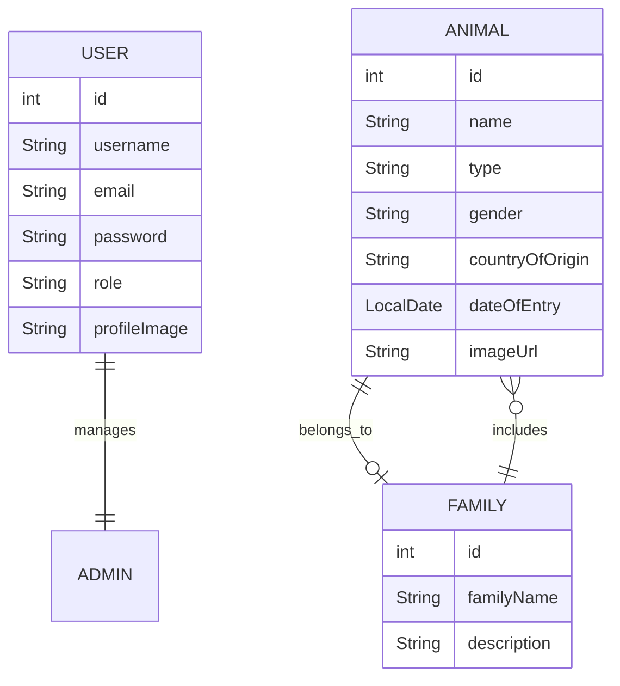

# WildCare API - Natural Reserve Management Project

# Objective

The project aims to provide a comprehensive management system for a natural reserve, focusing on maintaining and controlling its fauna. It allows an administrator to manage animal records, perform secure authentication, and retrieve information about the animals based on various criteria. In future versions, the project could expand to include more detailed animal profiles, tracking features, and visitor interactions.

# Getting Started - Installation

To run this project locally:

- Clone the repository: `git clone https://github.com/andreeaclmr/WildCare_API.git`

- Navigate to the project directory:
`cd WildCare-API`

- Run the application with Maven: `mvn spring-boot:run`

# Project Structure Overview

This project follows a layered architecture, with each layer responsible for a specific aspect of the application:

- Controller Layer: Manages incoming HTTP requests and handles the responses.

- Service Layer: Contains the business logic of the application, handling animal management operations.

- Repository Layer: Interfaces with the database using JPA (Data Access Object pattern).

- Model Layer: Represents the entities that map to database tables, such as Animal and its attributes.

- Exception Layer: Custom exception handling to provide meaningful error messages and manage validation failures.

# Technologies Used

The project was built with Spring Boot Initializr version 3.3.6, JAR Packaging, and Java 21.

## Frameworks

- Spring

- Spring Boot Dependencies:

- spring-boot-starter-data-jpa

- spring-boot-starter-web

- spring-boot-starter-validation

- jackson-datatype-jsr310

- Lombok

## Dependencies:

- Spring Web

- Spring Data JPA

- MySQL Driver

- Lombok

- Spring Boot DevTool

- Validation

- Spring Security

## Database

- MySQL

- H2

- PostgreSQL

## Database Drivers:

- mysql-connector-j

- postgresql

- h2

# Testing

## Spring Boot Testing Dependencies:

- spring-boot-starter-test

- junit-jupiter-api

- junit-jupiter-engine

- mockito-core

- mockito-junit-jupiter

# Development Tools

- IntelliJ IDEA Community Edition

- Java

- Maven

- Postman

- Git

- GitHub

- GitHub Projects

- Docker

- Swagger

# Functionalities

- [x] View all animals in the reserve with pagination.

- [x] Filter animals by family, type, or country of origin.

- [x] Add, update, or delete animal records (admin-only actions).

- [x] Retrieve detailed information about a specific animal.

- [x] Manage authentication with admin-level access (ROLE_ADMIN).

- [x] Secure the API with JWT or Basic Auth (to be implemented).

# UML Diagram

# E/R Diagram

# Profiles

Added application-dev.properties, application-test.properties, and application-prod.properties for environment-specific configurations.

Updated application.properties to set dev as the default active profile to begin with.

Configured database settings and Hibernate behavior for each profile:

- dev: In-memory H2 database with schema updates.

- test: Separate H2 database for testing with create-drop behavior.

- prod: MySQL database with schema validation.

## Testing the active profiles:

Verified profile switching with spring.profiles.active and ensured correct configurations load.

`mvn spring-boot:run -Dspring-boot.run.profiles=dev`

`mvn spring-boot:run -Dspring-boot.run.profiles=test`

`mvn spring-boot:run -Dspring-boot.run.profiles=prod`

## Tests

Steps to execute the application and pass the tests:

[In progress] Unit tests for animal management.

[In progress] Global exception handling tests.

# API Documentation

This project uses Swagger for documenting the API endpoints. Swagger provides an interactive interface to explore and test the APIs.

# About Me
### **Andreea Celmare**

  

